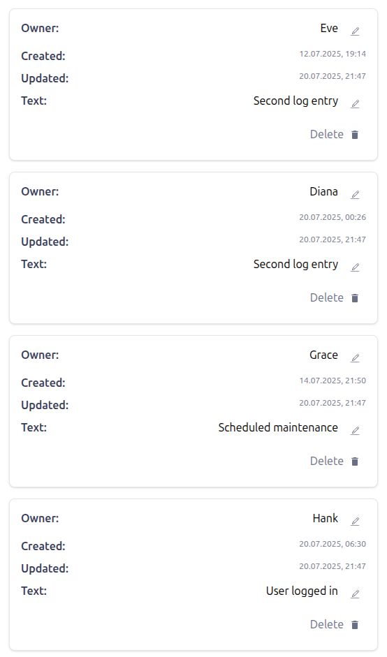

# Log System

A modern React application for managing and tracking log entries. Features include log editing, deletion, responsive layouts for desktop and mobile, pagination, and real-time notifications. Built with React 19, TypeScript, Tailwind CSS, and Vite for a fast and seamless user experience.
<table>
  <tr>
    <td valign="top">
			<figure>
				<figcaption>Desktop Preview</figcaption>
				
			</figure>
		</td>
		<td valign="top">
			<figure>
				<figcaption>Mobile Preview</figcaption>
				
			</figure>
		</td>
</table>

## Tech Stack

- **[React](https://react.dev/)**: Modern UI library for building interactive interfaces
- **[TypeScript](https://www.typescriptlang.org/)**: Static typing for safer and more robust code
- **[Tailwind CSS](https://tailwindcss.com/)**: Utility-first CSS framework for rapid styling
- **[Vite](https://vite.dev/)**: Next-generation frontend tooling for fast development and builds
- **[React Icons](https://react-icons.github.io/react-icons/)**: Icon library for React
- **[React Toastify](https://fkhadra.github.io/react-toastify/)**: Elegant notifications for React apps
- **[React Spinners](https://www.davidhu.io/react-spinners/)**: Beautiful loading spinners
- **[Express](https://expressjs.com/)**: Backend API for serving and mutating logs
- **[Axios](https://axios-http.com/)**: Promise-based HTTP client
- **[Vitest](https://vitest.dev/)** & **[Testing Library](https://testing-library.com/)**: Unit and integration testing
- **[ESLint](https://eslint.org/)** & **[Prettier](https://prettier.io/)**: Code quality and formatting

## Features

### Log Management
- **View Logs**: Paginated list of logs with owner, text, created, and updated timestamps
- **Edit Logs**: Inline editing for owner and text fields with validation
- **Delete Logs**: Confirmation modal before deletion
- **Responsive Layout**: Table view for desktop, card view for mobile
- **Pagination**: Navigate through multiple pages of logs

### User Experience
- **Real-time Notifications**: Success and error toasts for user actions
- **Loading States**: Animated spinner during data fetching
- **Accessibility**: Keyboard navigation, ARIA roles, and focus management
- **Modal Dialogs**: Accessible modals for confirmations

## Pages

### Home Page (`/`)
- Displays paginated logs
- Edit and delete actions for each log
- Responsive design for all devices

## Getting Started

Before starting 🏁, ensure you have [Git](https://git-scm.com) and [Node.js](https://nodejs.org/en/) installed.

```bash
# Clone this project
git clone https://github.com/your-username/log-system

# Access the project directory
cd log-system

# Install dependencies
npm install
# or
yarn install

# Start the backend server
npm run start
# or
yarn start

# In a new terminal, start the frontend development server
npm run dev
# or
yarn dev

# Build for production
npm run build
# or
yarn build

# Preview production build
npm run preview
# or
yarn preview

# Run linting
npm run lint
# or
yarn lint

# Run tests
npm run test
# or
yarn test
```

Open [http://localhost:5173](http://localhost:5173) (or the port shown in your terminal) to see the app.

## Project Structure

### Components
- **TableLogs**: Main log table/card component with editing and deletion
- **DesktopLayout**: Table layout for desktop screens
- **MobileLayout**: Card layout for mobile screens
- **Modal**: Generic modal dialog
- **DeleteModal**: Confirmation dialog for deletions
- **UI Components**: Button, Input, Pagination, Loader

### Hooks
- **useFetch**: Data fetching with loading and error states
- **usePagination**: Pagination logic for arrays
- **useWindowWidth**: Responsive breakpoint detection

### Utilities
- **formatDate**: Date formatting helper

### API
- **logsApi**: Functions for fetching, editing, and deleting logs

## Folder Structure

```
src/
├── api/                # API functions for backend communication
├── components/         # Reusable UI and layout components
│   ├── logsLayout/     # Desktop and mobile layouts
│   ├── modals/         # Modal dialogs
│   └── UI/             # Generic UI components
├── hooks/              # Custom React hooks
├── utils/              # Utility functions
├── tests/              # Unit and integration tests
├── App.tsx             # Main app component
├── main.tsx            # Entry point
├── index.css           # Tailwind CSS styles
└── vite-env.d.ts       # Vite environment types
shared/
├── constants/          # Shared constants (e.g., table headings)
├── data/               # Mock data for development/server
└── types/              # TypeScript type definitions
server/
└── server.ts           # Express backend server
```

## API Endpoints

- `GET /logs` — Fetch all logs
- `PUT /logs/:id` — Edit a log by ID
- `DELETE /logs/:id` — Delete a log by ID

## Performance Optimizations

- **React.memo**: Prevents unnecessary re-renders of UI components
- **useMemo**: Memoizes expensive calculations
- **useCallback**: Memoizes event handlers
- **Code Splitting**: Lazy loading for layouts and modals

## Future Enhancements

- **Add Log**: Ability to create new logs
- **Search & Filter**: Search logs by owner or text
- **Sorting**: Sort logs by date or owner
- **User Authentication**: Multi-user support
- **Export Data**: Download logs as CSV/JSON

## Contributing

Contributions are welcome! Please feel free to submit a Pull Request or open an Issue.

---
